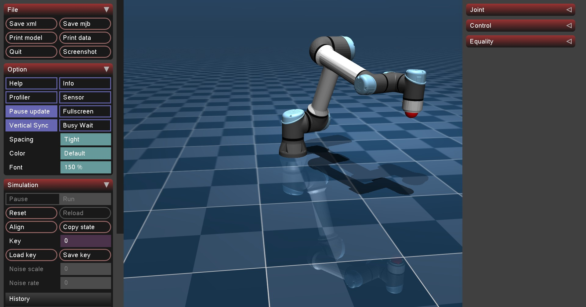
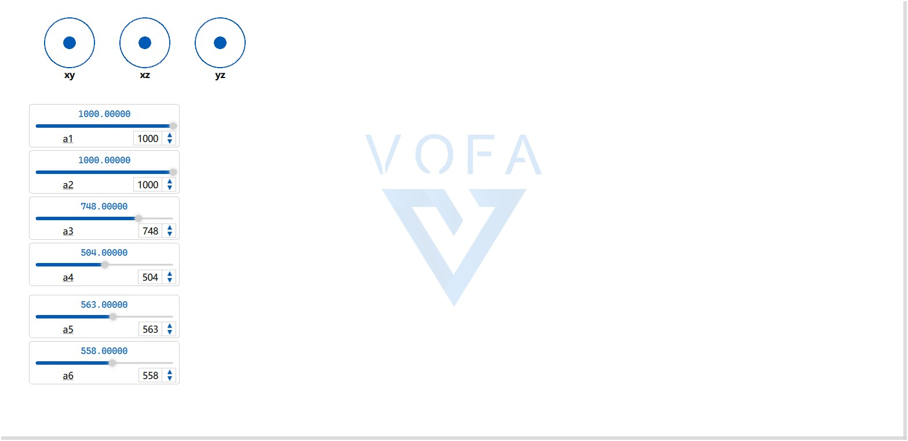

# UR5e MuJoCo 运动学与虚拟串口控制仿真 🤖

本项目包含基于 MuJoCo 物理引擎的 UR5e 机械臂仿真控制核心代码。支持正运动学（FK）与逆运动学（IK）的无缝切换，并通过 VOFA+ 上位机实现虚拟串口的实时交互控制。

## 📸 运行效果

### MuJoCo 仿真端


### VOFA+ 上位机控制端


## 🚀 核心功能与架构

本项目采用工业级代码规范，将算法核心与通信控制解耦：

* **`Core_IK.py` (逆运动学核心)**：基于阻尼最小二乘法（DLS）的逆运动学求解器。支持纯运动学模式与物理动力学模式，解决奇异点死锁，轨迹平滑无震荡。
* **`Core_FK.py` (正运动学核心)**：直接控制各关节角度，支持多自由度自适应，结合官方 `mj_integratePos` API 实现高频稳定运行。
* **`serial_arm.py` (双模串口控制台)**：
    * **多线程串口监听**：后台非阻塞读取虚拟串口（如 COM4）数据。
    * **摇杆/滑块控制 (IK)**：接收 `xy`, `xz`, `yz` 摇杆指令，控制机械臂末端空间平移。
    * **关节独立控制 (FK)**：接收 `a1` ~ `a6` 滑条指令，独立控制六个关节旋转。
    * **瞬间复位**：支持接收 `p:0,0,0` 指令，让机械臂瞬间回正至安全初始位姿。

## 🛠️ 依赖环境

* Python 3.x
* `mujoco` (MuJoCo 官方 Python 绑定)
* `pyserial` (串口通信)
* `numpy`

## 🎮 使用说明

1. 确保已安装虚拟串口软件（如 VSPD），并配对好端口（如 COM3 <-> COM4）。
2. 在 VOFA+ 中打开 COM3，将数据引擎设置为 `RawData`，并点亮 `DTR` 和 `RTS`。
3. 运行 Python 主程序：
   ```bash
   python serial_arm.py
